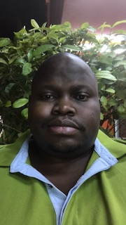

# RWiOSBootcamp


[](https://opensource.org/licenses/MIT)

[](https://developer.apple.com/swift)
[](http://makeapullrequest.com)
[](http://twitter.com/byaruhaf)

# About Me
| Command | Description |
| --- | --- |
``` swift
import MeKit

let Name: String = "Byarunaga Franklin"

let DiscordUsername: String = "TM Franklin"

let loaction:CLLocationManager = "Uganda" "🇺🇬"

let ProgrammingExperience: String = "1 year with iOS & Swift"

let Goals:[String] = ["Become an indi iOS developer"]

let Hobbies&Interests:[String] = ["Coding", "Music", "Beer"]
```
