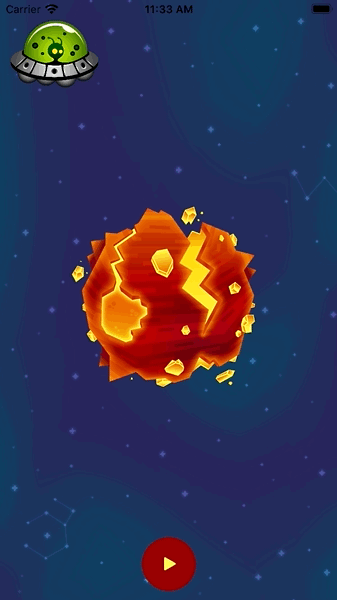

# Mixer App

## Week 11 Assignment

Build an app to demo UIKIT Animations

### Assignment Requirements completed
* A RadialMenu with 3 buttons
* Add animation Object to animate
* Now, on pressing every button, you have to add an animation So for three buttons there would be 3 animations chained. If I press 2 buttons, then only those 2 animations will be triggered. 
* The final animations start when the center is clicked again, which closes the menu also

### Stretch Above and Beyond Requirements completed:
* Create a notification kinda thing to intimate the user that the animation was added successfully.

## App Features Demo
| Size| Move| Spin | combo|
|:-------------------------:|:-------------------------:|:-------------------------:|:-------------------------:
|  |   |  |  

## Contribution
- If you have a **feature request**, open an **issue**
- If you want to **contribute**, submit a **pull request**

## License
[MIT License](https://github.com/byaruhaf/RWiOSBootcamp/blob/master/LICENSE).