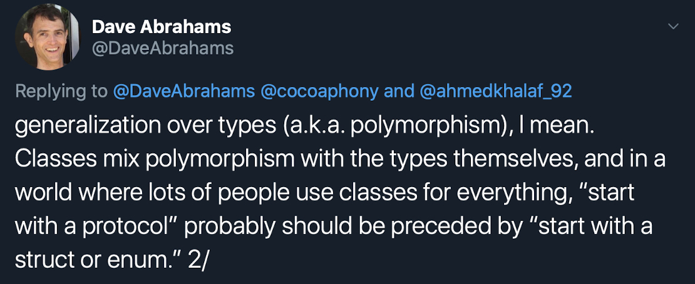

# BullsEye Game App Collection 

## Week 2 Assignment

Refactor the [BullsEye](https://files.betamax.raywenderlich.com/attachments/videos/1927/20a3598d-8d8d-4044-ad39-5a1d58c62ad9.zip) project to make it conform to the Model-View-Controller architecture.
The app can be used with any iPhone that supports **[iOS 13](https://support.apple.com/en-il/guide/iphone/iphe3fa5df43/ios)**

### Assigment Requirements completed
* Refactor the ViewController in BullsEye Game to create a UI-independent model.
* Test UI-independent model on RGBullsEye Game replace Int() type with RGB() type.
* modify slider’s minimum track tint color in BullsEye Game to provide a visual hint to the player

### Stretch Above and Beyond Requirements completed:
* “Reverse” the BullsEye game to use a text field.
* Modify slider’s minimum track tint color in RevBullsEye Game to provide a visual hint to the player
* Prevent the user from submitting text that won’t work, either because
    * The text isn’t a number
    * The Number outside the slider’s range
* User can dismiss the keyboard using two methods for the RevBullsEye
     1. Tap screen
    2. Tap done button 
 

### Additional Assignment Goals completed
* Groups all game projects and packages under one Xcode workspace so it's easier to work on them together
* Model code for games BullsEye & RevBullsEye moved to Swift Package to avoid duplicating code.
* As an SPM Package model code can be distributed to other developers to make their version of BullsEye
* Use Apples Combine framework so UI can listen for changes in the model.
* Show animation when the user has a high score. 

### Class vs Struct:
My personal preference is always to start with a struct. **why you wonder?**

Because Crusty said so.

 

**All joking aside,**

The reason I prefer structs is the value semantics especially mutability. But as game model required **mutation** I changed the model to a class to avoid adding mutation keyword to all my model functions. The next version of the 3 games could be rewritten for **MVVM** so the **model** is a struct & the **view model** is a class.  

### Shared Game assets :
The shared game assets could also be moved from the individual game project to Swift Package.
The feature **[SE-0271: Package Manager Resources](https://github.com/apple/swift-evolution/blob/master/proposals/0271-package-manager-resources.md)** will be available in swift 5.3. So the next version of BullsEye & RevBullsEye can take advantage of that. 

## App Demo
### BullsEye

### RGBullsEye

## Attribution
Game Background Image created by <a href='https://www.freepik.com/upklyak'> upklyak</a>

## Contribution
- If you have a **feature request**, open an **issue**
- If you want to **contribute**, submit a **pull request**

## License
[MIT License](https://github.com/byaruhaf/RWiOSBootcamp/blob/master/LICENSE).
