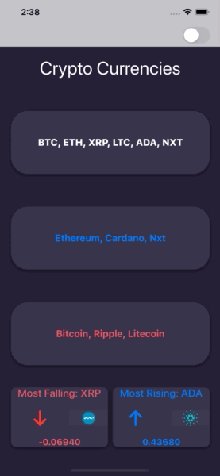
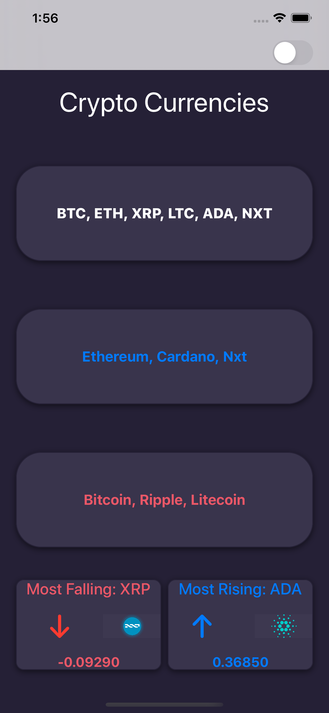
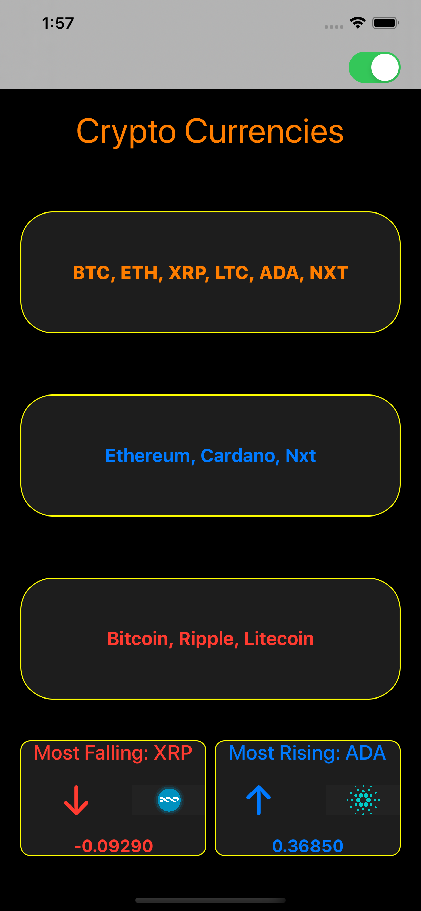

# Cryptly App 

## Week 3 Assignment

Create an app called Cryptly that displays prices of cryptocurrencies

### Assignment Requirements completed
* Create an app data model CryptoCurrency
* Decode JSON data to the app data model
* Update the user interface based on the app data model. 
* use only filter() and/or reduce() to extract view data from the model 
* use protocols and NotificationCenter to change app theme based on the toggle button state

### Stretch Above and Beyond Requirements completed:
* Refactor setupViews() function in to a custom UIView
* Add trend & percentageRise variables to the app model
* Display Most Falling and Most Rising cryptocurrencies
* create a Roundable protocol for a custom view restricted to the class UIView.
 

### Additional Assignment Goals completed
* Added ViewModel to prepare the model data for the view. 
* Added animation during the change of theme's
* Added network component to fetch data from a remote [Nomics API](api.nomics.com)
* Using swift's Result type for the Asynchronous completion handler
* Disabled dark mode on the app

## App Demo

|Light Mode|Dark Mode|
|:-------------------------:|:-------------------------
|  |   |

## Attribution
App logo by [TempusInfernus](https://en.wikipedia.org/wiki/File:Cryptocurrency_Logo.svg)

## Contribution
- If you have a **feature request**, open an **issue**
- If you want to **contribute**, submit a **pull request**

## License
[MIT License](https://github.com/byaruhaf/RWiOSBootcamp/blob/master/LICENSE).
