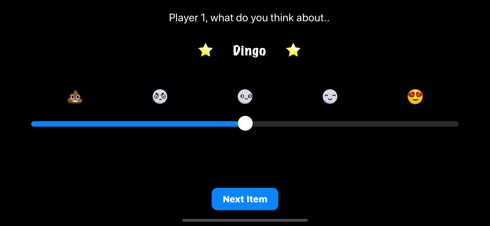

# ComparisonShopper & CompatibilitySlider

## Week 4 Assignment

Practice Debugging on ComparisonShopper & build a mini dating app called Compatibility Slider

### Assignment Requirements completed
* Fix app crash of ComparisonShopper
* Fix app missing UI display for the second house in ComparisonShopper
* Layout Compatibility Slider using autolayout
* add App Logic to Compatibility Slider
* use protocols and NotificationCenter to change app theme based on the toggle button state 

### Additional Assignment Goals completed
* Fixed unattached outlet in ComparisonShopper
* Added keyboard Type restrictions to the beds and price textFields in ComparisonShopper
* Fixed Compatibility calculation in Compatibility Slider
* Added animation to smooth the transition between animals in Compatibility Slider
* UX Testing revealed users kept clicking the emojis of the  Compatibility Slider so added a tap Gesture Recognizer's to the emojis to move the slider to set positions.
* Added XCTest for the calculateCompatibility function in Compatibility Slider app.
* Added UI Testing for Compatibility Slider app.

## App Demo

| Comparison Shopper| Compatibility Slider|
|:-------------------------:|:-------------------------
|  |   |

## Contribution
- If you have a **feature request**, open an **issue**
- If you want to **contribute**, submit a **pull request**

## License
[MIT License](https://github.com/byaruhaf/RWiOSBootcamp/blob/master/LICENSE).
