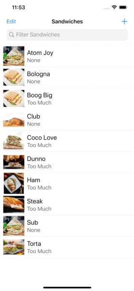

# SandwichSaturation App in SwiftUI

## Week 8 Assignment

Updated the SandwichSaturation app with data persistence with core data.

### Assignment Requirements completed
* Save Scope Bar Selection into User Defaults so it can persist between app launches.
* Remove hard-coded sandwiches & load Data from JSON File (sandwiches.json) 
* Create a Core Data model and only on first launch seed the model with data from JSON File
* Use Core Data to retrieve data for display in the TableView
* When a user Adds a New Sandwich, ensure it is saved to Core Data.
* Re-wire the filter functionality to use Core Data queries using NSCompoundPredicate

### Stretch Above and Beyond Requirements completed:
* Allow users to delete sandwiches from the tableview & Core Data.
* Use Core Data to sort sandwiches alphabetically using NSSortDescriptor

#### Other options for packaging seed data
Another option for packaging seed data is a Property List (plist)

*Features of using a Property List (plist)*

* File-based approach for persisting simply-structured data sets
* Entire contents of a plist get loaded into memory when you access the file
* Way to ship initial configuration for your app
* Capable of storing lists of data with predictable size

if I were shipping SandwichSaturation, i would pick JSON over the Property List, here are the reasons why

* JSON is a very simple, but very powerful way to express data.
* JSON tends to yield more compact data/files than XML, but still can be quite readable (unlike binary).
* JSON data structures map naturally onto concepts supported by just about every language and library.
* Swift swift supports JSON natively with Codable, thus its easy to handel JSON files,
* JSON became the file format of choice because everyone can share the files. This makes use of JSON quite nice when you work in a multi-platform situation. Just write the file once, share it, life goes on.

## App Features Demo

| Add | Delete |
|:-------------------------:|:-------------------------:
|  |   | 

## Contribution
- If you have a **feature request**, open an **issue**
- If you want to **contribute**, submit a **pull request**

## License
[MIT License](https://github.com/byaruhaf/RWiOSBootcamp/blob/master/LICENSE).